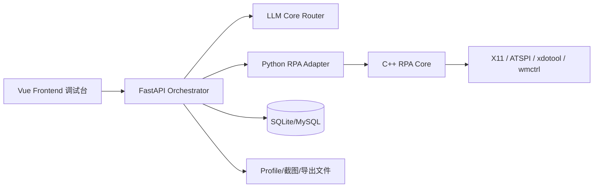

# WeChat Copilot 重建落地蓝图（无源码重写版）

> 版本：v1.0  
> 更新时间：2026-02-22  
> 目标读者：新机器上的新团队（不提供当前源码，仅凭本说明重写）

---

## 1. 文档目标与重建原则

本文件用于指导团队在**不依赖现有代码**的前提下，重建一个更完善的微信自动化系统，目标是：

- 最短时间理解项目全貌
- 按统一标准实现后端、前端、RPA、LLM、数据层
- 具备可扩展性（工具、场景、模型、动作类型）
- 可验证、可运维、可迁移

### 1.1 三个核心原则

1. **接口先行**：先定义 API/JSON 合同，再编码。
2. **分层清晰**：RPA 原子能力和业务编排严格分离。
3. **可回退执行**：ATSPI 失败后，必须有模板/OCR/几何兜底链路。

### 1.2 重写范围

- Linux 桌面微信自动化（X11 优先）
- C++ RPA 核心 + Python FastAPI 服务 + Vue 前端
- 多模态 LLM 统一入口（3 场景）
- 数据持久化、日志、工具注册、场景配置

---

## 2. 产品能力边界

## 2.1 已验证能力（重建必须覆盖）

- 微信窗口激活、定位、锁窗
- 5 区域扫描（search_bar/main_menu/contact_list/chat_display/chat_input）
- 手动扫描（空格采样、回车结束、ESC退出）
- 全量扫描任务异步化（开始/状态/取消）
- ATSPI 树快照、控件坐标、点击校验
- 截图/OCR 识别和结构化存储
- LLM 统一入口：界面分析、SOP 生成、多模态聊天

## 2.2 非目标（第一阶段不做）

- 多租户 SaaS 架构
- 大规模分布式任务系统
- Android/iOS 客户端

---

## 3. 总体架构（建议重建版）



### 3.1 分层职责

- **Frontend**：调试、配置、可视化、日志查看
- **FastAPI Orchestrator**：路由聚合、流程编排、状态机、DTO
- **LLM Core**：统一请求协议、场景路由、工具调用、动作输出
- **RPA Adapter**：Python 封装 C++ 能力，屏蔽系统差异
- **C++ RPA Core**：窗口、ATSPI、截图、拟人化动作
- **Data Layer**：业务表 + 配置表 + 请求日志 + 工具注册

---

## 4. 推荐技术栈

## 4.1 后端

- Python 3.11
- FastAPI + Uvicorn
- SQLModel + SQLAlchemy
- aiohttp/requests（LLM 与外部工具）
- OpenCV + PaddleOCR

## 4.2 前端

- Vue 3 + Vite
- Vue Router
- Axios

## 4.3 系统与自动化

- C++17 + CMake + pybind11
- xdotool / wmctrl / maim
- AT-SPI2

### 4.3.1 微信自动化 API 设计参考（wxauto 借鉴）

> 参考来源：
> - https://docs.wxauto.org/docs/install.html
> - https://docs.wxauto.org/v3.9/docs/class/WeChat.html

关键结论：

- wxauto 在**对象模型分层**上非常清晰：`WeChat`（总入口） -> `SessionBox`（会话列表） -> `Chat`（聊天窗口） -> `Message`（消息对象）。
- wxauto 在**事件监听模型**上定义了完整生命周期：`AddListenChat` / `StartListening` / `GetNextNewMessage` / `StopListening` / `KeepRunning`。
- wxauto 方法以**原子动作**为主：`ChatWith`、`GetSession`、`SwitchToChat`、`SwitchToContact`、`GetFriendDetails`、`AddNewFriend`、`SendUrlCard`。
- 安装文档显示其主要面向 Windows 环境；本项目为 Linux + C++ RPA，不直接复用实现，但可复用**接口思路与对象语义**。

## 4.4 存储

- 开发期：SQLite
- 生产建议：MySQL（保留 DDL 兼容）

---

## 5. 目录规划（重建建议）

```text
project-root/
├─ backend/
│  ├─ api/v1/
│  │  ├─ llm_core.py
│  │  ├─ rpa_compatibility.py
│  │  ├─ atspi_analysis.py
│  │  ├─ layout_control.py
│  │  ├─ messages.py
│  │  ├─ message_ops.py
│  │  ├─ wechat_ops.py
│  │  ├─ users.py
│  │  ├─ sop.py
│  │  └─ ...
│  ├─ db/
│  │  ├─ models.py
│  │  └─ session.py
│  ├─ core/
│  │  ├─ ai_client.py
│  │  └─ config.py
│  ├─ data/
│  │  ├─ wechat.db
│  │  └─ ui_analysis_profiles.json
│  └─ main.py
├─ cpp_rpa/
│  ├─ include/
│  ├─ src/
│  ├─ bindings/python_bindings.cpp
│  └─ CMakeLists.txt
├─ frontend/
│  ├─ src/
│  │  ├─ views/
│  │  │  ├─ RPATest.vue
│  │  │  ├─ ATSPIAnalysis.vue
│  │  │  ├─ LLMCoreDebug.vue
│  │  │  └─ ...
│  │  ├─ api/index.js
│  │  ├─ App.vue
│  │  └─ main.js
│  └─ vite.config.js
├─ config/model_config.py
└─ docs/
```

---

## 6. 数据模型（重建必须实现）

## 6.1 基础业务表

### user
- id (PK)
- wechat_id (unique)
- nickname
- tags (JSON string)
- summary
- last_contact
- created_at

### message
- id (PK)
- user_id (FK)
- role (user/assistant)
- content
- timestamp
- session_id
- confidence

### sop_rule
- id (PK)
- name
- trigger_keyword
- reply_template
- delay_seconds
- enabled
- created_at

## 6.2 ATSPI 分析表

### wechat_atspi_nodes
- id (PK)
- window_title, window_class
- access_path, depth, parent_id, index
- name, role, text
- ocr_text, ocr_number
- x, y, width, height
- client_x, client_y
- screenshot_path, full_image_path
- page_type, function_type
- created_at

## 6.3 LLM 框架表

### llm_tool_registry
- tool_name (unique)
- description
- input_schema (JSON string)
- output_schema (JSON string)
- enabled
- created_at, updated_at

### llm_scene_config
- scene_type (unique)
- config_json (JSON string)
- enabled
- created_at, updated_at

### llm_request_log
- request_id (unique)
- scene_type
- user_id
- model_used
- status_code
- success
- execution_time_ms
- request_json
- response_json
- error_message
- created_at

---

## 7. 后端 API 全景（按模块）

> 说明：以下是当前项目接口清单的重建参考，建议在新项目中保持路径兼容，便于迁移前端。

## 7.1 健康与根路由
- GET /
- GET /health

## 7.2 用户与消息
- GET /api/v1/users
- GET /api/v1/users/{user_id}
- PUT /api/v1/users/{user_id}
- DELETE /api/v1/users/{user_id}
- GET /api/v1/extract-messages
- POST /api/v1/send-message
- POST /api/v1/process-message-with-ai

## 7.3 RPA 主链路（兼容）
- POST /api/v1/rpa/handle-message
- GET /api/v1/rpa/test
- GET /api/v1/rpa/status
- POST /api/v1/rpa/wechat/check_status
- POST /api/v1/rpa/wechat/get_window_info
- POST /api/v1/rpa/wechat/messages/latest
- POST /api/v1/rpa/wechat/capture_message_area
- POST /api/v1/rpa/wechat/contacts/search
- POST /api/v1/rpa/wechat/contacts/list
- POST /api/v1/rpa/atspi/click_control
- POST /api/v1/rpa/atspi/input_text
- POST /api/v1/rpa/atspi/get_text
- POST /api/v1/rpa/atspi/get_messages
- POST /api/v1/rpa/atspi/get_contacts
- POST /api/v1/rpa/atspi/get_ui_elements
- POST /api/v1/rpa/atspi/traverse_control_tree
- POST /api/v1/rpa/ocr/extract_text
- GET /api/v1/rpa/ui-elements
- GET /api/v1/rpa/ui-tree-analysis

## 7.4 RPA 兼容增强链路（重点）
- 手动扫描：
  - POST /api/v1/wechat/ui_profile/manual_scan/start
  - GET /api/v1/wechat/ui_profile/manual_scan/status
  - POST /api/v1/wechat/ui_profile/manual_scan/capture
  - POST /api/v1/wechat/ui_profile/manual_scan/finish
  - POST /api/v1/wechat/ui_profile/manual_scan/abort
- 全量扫描异步任务：
  - POST /api/v1/wechat/ui_profile/full_scan_async/start
  - GET /api/v1/wechat/ui_profile/full_scan_async/status
  - POST /api/v1/wechat/ui_profile/full_scan_async/cancel
- Profile 构建：
  - POST /api/v1/wechat/ui_profile/build
  - GET /api/v1/wechat/ui_profile/annotated_preview
  - GET /api/v1/wechat/ui_profile/get
  - GET /api/v1/wechat/ui_profile/list
  - GET /api/v1/wechat/ui_profile/export
  - POST /api/v1/wechat/ui_profile/import
- ATSPI 快照增强：
  - POST /api/v1/atspi/tree_snapshot
  - POST /api/v1/atspi/click_by_bounds

## 7.4.1 微信 API 框架升级（吸收 wxauto 经验）

为新团队降低学习成本，建议将当前 C++ RPA 能力按“wxauto 风格语义”重新组织为稳定 API 层（保留现有兼容路径不变）。

### A. 对象语义映射（建议）

- `WeChatFacade`（统一入口）
  - 职责：连接状态、窗口激活、页面切换、会话入口。
  - 对应现有能力：`check_status/get_window_info/fix_window/activate`。

- `SessionService`（会话列表）
  - 职责：获取会话、筛选、打开会话。
  - 对应现有能力：联系人/会话列表抓取、`ChatWith` 等价操作。

- `ChatService`（聊天窗口）
  - 职责：读取消息、发送文本/图片/文件/卡片、输入框操作。
  - 对应现有能力：AT-SPI 控件点击、输入、消息区 OCR。

- `ListenerService`（监听/增量消息）
  - 职责：监听注册、增量拉取、去重与 ACK。
  - 对应现有能力：`GetNextNewMessage` 思路 + 本地轮询/事件桥。

### B. 推荐 API 分组（新增规划）

在保留旧路径的前提下，新增以下标准分组：

- `/api/v1/wechat/core/*`
  - `online`、`my_info`、`window_info`、`switch_tab(chat/contact)`
- `/api/v1/wechat/session/*`
  - `list`、`open`、`recent_groups`
- `/api/v1/wechat/chat/*`
  - `messages`、`send_text`、`send_image`、`send_file`、`send_url_card`
- `/api/v1/wechat/listen/*`
  - `add`、`remove`、`start`、`stop`、`next`
- `/api/v1/wechat/contact/*`
  - `friends`、`new_friends`、`add_friend`

### C. 统一返回结构（建议强制）

```json
{
  "success": true,
  "code": 0,
  "message": "ok",
  "request_id": "req_xxx",
  "data": {},
  "error": null,
  "meta": {
    "source": "cpp_rpa",
    "elapsed_ms": 120,
    "fallback_used": false
  }
}
```

### D. 消息对象标准（借鉴 wxauto Message）

```json
{
  "chat_name": "张三",
  "chat_type": "friend",
  "msg_id": "wx_123",
  "msg_type": "text|image|audio|file|system",
  "sender": "me|other|system",
  "content": "文本内容或转写内容",
  "file_path": "",
  "timestamp": "2026-02-22T10:30:00",
  "extra": {}
}
```

### E. 监听生命周期标准（必须）

- `listen/add`：注册监听对象 + 回调路由键。
- `listen/start`：启动后台监听循环（单例守护）。
- `listen/next`：拉取增量消息（含去重标记）。
- `listen/stop`：停止监听并释放资源。
- 守护线程/循环必须具备：超时、心跳、重启、自恢复。

### F. 风险与兼容策略（吸收文档经验）

- 自动化速度参数必须可配置（滚动速度/轮询间隔）。
- 好友/群列表大规模抓取需分页，避免长阻塞。
- 任何联系人操作（加好友、处理申请）必须加“人工确认开关”。
- UI 变化导致定位失败时，走 ATSPI -> OCR -> 几何 兜底链。

## 7.4.2 新团队实施路线（微信 API 部分）

1. 先实现 `core/session/chat` 三层同步 API（不含监听）。
2. 再实现 `listen` 增量链路与去重存储。
3. 再补齐 `contact` 类接口（加好友、申请处理、标签回填）。
4. 最后做全链路压测（长时间监听 + 批量会话切换 + 失败恢复）。

## 7.4.3 当前项目已落地的标准化微信 API（新增）

> 前缀：`/api/v1/wechat`

- Core
  - `GET /core/online`
  - `GET /core/my_info`
  - `GET /core/window_info`
  - `POST /core/switch_tab`
- Session
  - `GET /session/list`
  - `POST /session/open`
  - `GET /session/recent_groups`
- Chat
  - `GET /chat/messages`
  - `POST /chat/send_text`
  - `POST /chat/send_image`
  - `POST /chat/send_file`
  - `POST /chat/send_url_card`
- Listen
  - `POST /listen/add`
  - `POST /listen/remove`
  - `POST /listen/start`
  - `POST /listen/stop`
  - `GET /listen/next`
- Contact
  - `GET /contact/friends`
  - `GET /contact/new_friends`
  - `POST /contact/add_friend`

## 7.5 ATSPI 截图分析模块
- POST /api/v1/atspi/capture
- GET /api/v1/atspi/list
- POST /api/v1/atspi/update
- POST /api/v1/atspi/delete
- GET /api/v1/atspi/export
- GET /api/v1/atspi/image
- GET /api/v1/atspi/mysql_ddl

## 7.6 LLM 统一核心模块（新增重点）
- GET /api/v1/llm/schema
- POST /api/v1/llm/core
- GET /api/v1/llm/tools
- POST /api/v1/llm/tools/register
- GET /api/v1/llm/scenes
- POST /api/v1/llm/scenes/config
- GET /api/v1/llm/logs

### 统一调度中心定位（新增）

- 全部 AI 能力归口到 `POST /api/v1/llm/core`。
- 内部按 `scene_type` 路由：界面分析 / SOP 生成 / 多模态聊天 / 系统进化分析。
- 模型路由策略遵循 `local -> doubao -> alibaba` 的分级容错配置（按任务复杂度选择）。
- 工具调用与动作输出均走统一结构化协议，便于审计、回放、扩展。

---

## 8. LLM 统一协议（必须按合同实现）

## 8.1 统一请求

```json
{
  "request_id": "req_20260222_001",
  "scene_type": "interface_analysis",
  "user_id": "user_001",
  "context": {
    "history": [],
    "session_id": "session_xxx"
  },
  "input": {
    "text": "文字内容",
    "images": ["base64_or_url"],
    "audio": null,
    "files": ["file_url"],
    "structured_data": {}
  },
  "tools": {
    "enabled": ["ocr", "atspi_parse"],
    "force_call": null,
    "custom_params": {}
  },
  "config": {
    "model_preference": "auto",
    "response_format": "json",
    "timeout": 30000,
    "ext": {}
  }
}
```

## 8.2 统一响应

```json
{
  "code": 0,
  "msg": "success",
  "request_id": "req_20260222_001",
  "scene_type": "interface_analysis",
  "model_used": "local-llm",
  "execution_time": 1200,
  "data": {
    "output": {
      "text": "...",
      "audio": null,
      "images": [],
      "emoji": "👍",
      "structured": {}
    },
    "tool_calls": [],
    "actions": [],
    "ext": {}
  }
}
```

## 8.3 scene_type 设计

- interface_analysis：界面结构分析与控件语义
- sop_generation：客户维护 SOP 结构化产出
- multimodal_chat：文本/图片/音频/文件融合对话
- system_evolution：系统使用分析、优化建议、模块进化路径

## 8.3.1 场景别名（兼容）

- `ui/interface/界面分析` -> `interface_analysis`
- `sop/客户维护` -> `sop_generation`
- `chat/multimodal/聊天回复` -> `multimodal_chat`
- `system/系统分析` -> `system_evolution`

## 8.4 action_type 规范（建议）

- send_text
- send_voice
- send_image
- send_emoji
- execute_tool
- open_window

## 8.5 工具注册规范

每个工具必须声明：
- tool_name
- description
- input_schema(JSON Schema)
- output_schema(JSON Schema)
- enabled

内置建议工具：ocr、atspi_parse、hotspot_fetch、file_analyze、chat_analyze、product_recommend、tts、mark_as_read。

## 8.6 模型分级与容错策略（强制实现）

### 分级路由（auto 模式）

- normal_conversation：`local -> doubao`
- special_skill：`doubao -> local`
- complex_task：`alibaba -> doubao -> local`

### 显式偏好（model_preference）

- `local`：`local -> doubao`
- `doubao`：`doubao -> local`
- `alibaba`：`alibaba -> doubao -> local`
- `auto`：按意图分级路由

### 最低保障（必须）

- 无论任何失败场景，必须保证 `local` 与 `doubao` 至少尝试其一，满足“最低二选一可用”。

### 触发回退条件

除网络/接口错误外，以下也视为“无效响应”，必须触发下一层模型：

- 返回文本为空
- 语义为拒答或未匹配（如“无法/不支持/未匹配/请重试/暂不可用”等）
- 响应结构不满足场景所需最小字段

### Token 节省策略

- 默认小任务优先本地，减少 API 消耗
- 豆包仅用于本地失败或中等级任务
- 阿里千问仅用于高复杂任务（complex_task）
- 失败快速回退，不重复同一模型重试超过 1 次（建议）

### 返回字段约定（建议）

响应 `data.ext` 中应包含：

- `routing_intent`：本次意图判定
- `routing_chain`：实际尝试链路
- `routing_trace`：每个模型的 success/failed/skipped 轨迹
- `fallback_used`：是否发生回退

## 8.7 极简协议（省 token 模式）

用于高频调用与低延迟场景，仍走同一入口 `POST /api/v1/llm/core`。

### 极简请求

```json
{
  "scene": "interface_analysis",
  "hist": [],
  "text": "请分析界面",
  "img": "base64_or_url",
  "tools": ["ocr", "atspi_parse"],
  "model_route": "auto",
  "need_struct_output": true
}
```

### 极简响应（当 `config.response_format=compact_json`）

```json
{
  "text": "...",
  "emoji": "👍",
  "struct": {},
  "tools": [],
  "actions": [],
  "meta": {
    "request_id": "req_xxx",
    "scene_type": "interface_analysis",
    "model_used": "local",
    "execution_time": 1200
  }
}
```

## 8.8 三大核心场景 JSON 合同（可扩展）

### 8.8.1 interface_analysis

- 重点输入：`window_info`、`atspi_tree`、`screenshot`、`analysis_type`
- 重点输出：`page_type`、`controls[]`、`hierarchy`、`hotspots`
- 结构字段建议：`path/depth/role/name/text/ocr_text/ocr_number/screen_coord/client_coord/function/confidence`

### 8.8.2 sop_generation

- 重点输入：`date_info`、`customer_info`、`chat_history`、`hotspots`、`sop_type`
- 重点输出：`sop_name/sop_version/steps[]/recommended_products/risk_warnings`
- 步骤字段建议：`step_id/step_name/trigger/script_template/required_actions/tools/note`

### 8.8.3 multimodal_chat

- 重点输入：`text/images/audio/files/structured_data.chat_context`
- 重点输出：`text/audio/images/emoji/structured`
- 动作标准：`send_text/send_voice/send_image/send_emoji/execute_tool/open_window`

## 8.9 工具调用标准（扩展约束）

- 注册合同固定：`tool_name/description/input_schema/output_schema/enabled`
- 调用回传固定：`tool_name/status/params/result`
- 内置建议工具：`ocr/atspi_parse/hotspot_fetch/file_analyze/chat_analyze/product_recommend/tts/mark_as_read`
- 新增工具只需注册 JSON Schema，不改核心协议。

## 8.10 省 token 核心原则（强制）

1. 本地优先：规则与关键词命中优先本地处理。
2. 最小输入：仅传最近 N 条历史（默认 10）+ 必要多模态信息。
3. 最小输出：默认 JSON 结构，不输出冗余解释。
4. 批处理优先：画像/SOP/摘要采用定时批量，避免每轮实时生成。
5. 复用缓存：画像、SOP 模板、控件模板无变化不重算。

### 默认节流参数

- `max_history=10`
- `max_images=1`
- `max_text_chars=2000`

通过 `config.ext` 覆盖，统一由 LLM Core 在入参阶段裁剪。

---

## 9. RPA 识别融合设计（重建推荐）

## 9.1 多引擎优先级

1. ATSPI（语义强）
2. 模板+OCR（图像补盲）
3. 几何规则（兜底）

## 9.2 关键流程

1) fix_window（锁定窗口）
2) scan（鼠标扫描/ATSPI树）
3) fuse（候选融合）
4) annotate（人工修订）
5) build（生成 profile）
6) verify（确认图+点击校验）

## 9.3 手动扫描质量要求

- 仅比较所选分区（5 区域之一）
- 支持检测“停留变深”颜色变化
- 忽略鼠标指针局部扰动
- 候选按 hover_hits/稳定性排序

## 9.4 ATSPI 快照稳定性要求

- 激活微信后必须等待 2 秒再抓树
- 输出坐标诊断：全局命中率/本地命中率、窗口 delta
- 标记 suspect_coordinate_bias，给出 offset 建议

---

## 10. 前端页面规划（重建目标）

## 10.1 必备页面

- RPATest：RPA 全局调试与扫描构建
- ATSPIAnalysis：ATSPI 树截图分析与标注
- LLMCoreDebug：3 场景统一调试、日志查看
- SOPManagement/SOPEditor：流程管理
- WeChatAutomation：运行态看板

## 10.2 调试页关键功能

- API 请求体可视化编辑
- 响应 JSON 实时展示
- 工具调用链展示
- 动作指令展示
- 日志历史回放

---

## 11. 配置与运行规范

## 11.1 启动端口

- Backend：8000
- Frontend：3000

## 11.2 关键配置文件

- backend/.env（密钥、模型、地址）
- config/model_config.py（模型偏好）
- frontend/vite.config.js（代理）
- backend/data/ui_analysis_profiles.json（区域/标注）
- backend/data/wechat.db（开发期数据库）

## 11.3 运行命令

```bash
# backend
cd backend
source ../.venv/bin/activate
uvicorn main:app --host 0.0.0.0 --port 8000 --reload

# frontend
cd frontend
npm run dev
```

---

## 12. 新机器重建路线图（建议 10 天）

## Day 1-2：基础工程搭建
- 建立 backend/frontend/cpp_rpa 骨架
- 完成依赖安装与最小启动
- 健康检查与日志框架

## Day 3-4：RPA 基础能力
- 实现窗口管理、截图、基础点击输入
- ATSPI 树遍历最小版

## Day 5-6：扫描与标注闭环
- 手动扫描+异步扫描任务
- 标注构建与确认图

## Day 7：ATSPI 分析模块
- 入库、筛选、更新、删除、导出
- 前端分析页联调

## Day 8：LLM 统一核心
- /llm/core 与工具注册
- 三场景结构化输出

## Day 9：多模态与 SOP
- multimodal_chat + sop_generation 深化
- 结果动作映射

## Day 10：稳定性与验收
- 压测、失败回退、文档验收
- 发布候选版本

---

## 13. 质量与验收标准

## 13.1 功能验收

- 5 区域扫描可用，能中断、可追踪进度
- ATSPI 树快照可返回坐标诊断
- /llm/core 三场景请求均返回标准响应
- 工具注册和日志查询可用

## 13.2 稳定性验收

- 后端 2 小时连续运行无崩溃
- 关键 API 95% 请求 < 1.5s（本地环境）
- RPA 扫描流程 20 次回归成功率 > 90%

## 13.3 可维护性验收

- 所有接口有 OpenAPI 描述
- 错误码统一
- 日志具备 trace_id/request_id

---

## 14. 非功能设计建议

- 安全：API 密钥只走环境变量
- 可观测：请求日志 + 工具调用日志 + 扫描过程日志
- 并发：扫描任务独立状态机，支持取消
- 兼容：保留 /api/v1 与部分 /api 兼容路径
- 扩展：场景、工具、动作类型均可热扩展（配置+注册）

---

## 15. 风险清单与规避策略

1. **桌面环境差异（Wayland/X11）**
   - 策略：明确 X11 优先，提供兼容开关与诊断脚本。
2. **ATSPI 坐标偏移**
   - 策略：激活后等待、坐标诊断、窗口 delta 纠偏。
3. **OCR 误识别**
   - 策略：引入区域裁剪、文本规则、置信阈值。
4. **LLM 输出不稳定**
   - 策略：强制 JSON 输出 + schema 校验 + fallback。
5. **动作误触风险**
   - 策略：预验证 + 后验确认 + 人工确认开关。

---

## 16. 给重写团队的实施约束（强制）

- 先写协议文档（本文件）再写代码
- 所有 API 必须先定义 Request/Response DTO
- 不允许把业务逻辑写进前端
- 不允许让 C++ 层承担业务策略
- 所有 LLM 输出必须经过结构校验
- 所有扫描流程必须可取消、可观测

---

## 17. 附录：当前前端路由（重建参考）

- /
- /user/:id
- /rpa-test
- /customer-retargeting
- /sop-management
- /sop-editor
- /ai-assistant
- /wechat-automation
- /customers
- /settings
- /atspi-analysis
- /llm-core-debug

---

## 18. 交付物清单（你在新机器上应先产出）

1. 《系统架构设计说明》
2. 《API 合同文档（OpenAPI + JSON Schema）》
3. 《数据库设计说明（ER + DDL）》
4. 《RPA 识别融合设计说明》
5. 《LLM 场景与工具扩展说明》
6. 《部署与运维手册》
7. 《回归测试清单》

---

## 19. 一句话结论

该项目应被重建为一个**以 API 合同为中心**、**RPA 与 LLM 解耦**、**场景可扩展、工具可注册、动作可审计**的自动化平台；按本蓝图执行，可在不依赖现有源码的情况下快速落地并持续演进。

---

## 20. CRM 客户沉淀专项（新增）

- 标准文档：见 [docs/CRM_AUTO_PROFILE_MODULE_SPEC.md](docs/CRM_AUTO_PROFILE_MODULE_SPEC.md)
- 目标：微信聊天全量沉淀、摘要、画像、标签回填与前端闭环。
- 约束：必须复用 `POST /api/v1/llm/core`，并执行 token 节流策略。
- 交付：数据库表、接口、定时任务、导入导出、页面交互与可追溯日志。
