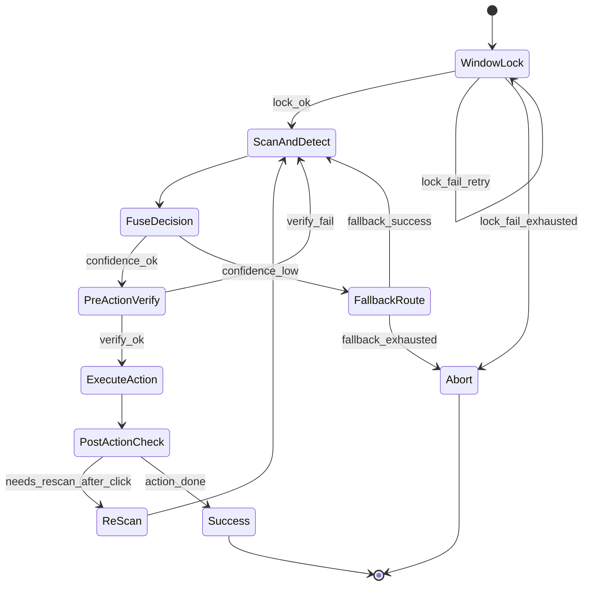

# 微信界面识别与控制规范（ATSPI + 模板 + OCR + 几何）

## 1. 目标与范围

本规范用于 Linux 环境下微信自动化的前期能力建设，输出可复用、可执行、可回退的界面识别与动作控制标准，覆盖以下场景：

- 识别关键元素：发送按钮、输入框、聊天记录区、联系人列表区、左侧菜单。
- 执行动作：点击、输入、滚动、读取消息。
- 支持失败回退：ATSPI 失败后自动切换模板/OCR/几何兜底。
- 支持人工标注固化：扫描结果经人工校正后落盘 profile，可直接调用。

---

## 2. 多引擎识别架构

### 2.1 引擎分层

- L1：ATSPI 语义层（优先）
  - 输入：应用辅助功能树（Role/Name/Text/Bounds/Action）
  - 输出：高置信元素候选（可点击/可输入/可读文本）

- L2：模板匹配层（补盲）
  - 输入：全窗口截图 + 模板库
  - 输出：图标类元素候选（含匹配分值）

- L3：局部 OCR 层（文字确认）
  - 输入：候选框局部截图
  - 输出：文本匹配结果（如“发送”“文件”“更多”）

- L4：几何比例层（兜底）
  - 输入：窗口锁定尺寸
  - 输出：关键区域近似框（联系人区、输入区、发送区）

### 2.2 统一元素模型

每个候选元素输出统一结构：

```json
{
  "element_id": "send_button",
  "type": "button",
  "source": "atspi|template|ocr|geometry",
  "bounds": {"x": 0, "y": 0, "width": 0, "height": 0},
  "confidence": 0.0,
  "clickable": true,
  "inputable": false,
  "readable": false,
  "actionability": "ready|needs_verify|fallback_only",
  "verify": {
    "name": "发送",
    "role": "push button",
    "text_hit": true,
    "template_score": 0.93
  }
}
```

---

## 3. 融合器决策表（核心）

| 场景 | 主路径 | 次路径 | 兜底 | 执行门槛 |
|---|---|---|---|---|
| 输入框识别 | ATSPI(role=text/entry) | 几何输入区 + OCR空框校验 | 几何固定框 | confidence >= 0.80 |
| 发送按钮识别 | ATSPI(name=发送, role=button) | 模板匹配 + OCR“发送” | 几何右下按钮区 | confidence >= 0.82 |
| 左侧菜单识别 | 模板匹配（图标） | ATSPI 节点 + 文本别名 | 几何左侧栏 | confidence >= 0.78 |
| 聊天记录读取 | ATSPI(text role) | 局部OCR（记录区） | 不建议纯几何读取 | text质量评分 >= 0.85 |
| 联系人列表点击 | ATSPI(list/list item) | 几何左栏 + OCR名称 | 几何行点击（低置信） | confidence >= 0.75 |

融合优先级：ATSPI > 模板+OCR > 模板 > 几何。

当多个来源命中同一元素时，按加权融合：

confidence = 0.50*atspi + 0.25*template + 0.15*ocr + 0.10*geometry

（不存在的项按 0 计分）

---

## 4. 控制状态机（执行闭环）



### 4.1 状态说明

- WindowLock：固定微信窗口尺寸和坐标。
- ScanAndDetect：真实鼠标扫描 + ATSPI + 模板/OCR 检测。
- FuseDecision：融合多来源候选并选取动作目标。
- PreActionVerify：动作前局部截图复核。
- ExecuteAction：执行点击/输入/滚动。
- PostActionCheck：检查动作后界面变化是否符合预期。
- ReScan：若标注要求重识别，回到扫描流程。

---

## 5. Profile 字段标准（落盘规范）

### 5.1 顶层字段

```json
{
  "profile_name": "wechat_main_layout",
  "status": "ready",
  "updated_at": "2026-02-20T12:00:00",
  "window_lock": {"x": 680, "y": 80, "width": 1200, "height": 860},
  "layers": {
    "base_scan_layer": [],
    "annotation_layer": [],
    "control_layer": [],
    "geometry_layer": {}
  },
  "execution": {
    "rescan_region_ids": [],
    "rescan_required_on_click": false,
    "retry_policy": {"max_retry": 3, "fallback_order": ["atspi", "template_ocr", "template", "geometry"]}
  },
  "stable_elements": []
}
```

### 5.2 stable_elements 字段

```json
{
  "id": "send_button",
  "name": "发送按钮",
  "function": "send_message",
  "type": "button",
  "bounds": {"x": 1020, "y": 790, "width": 140, "height": 48},
  "clickable": true,
  "needs_rescan_after_click": false,
  "confidence": 0.93,
  "source_preference": ["atspi", "template_ocr", "geometry"],
  "verify_rules": {
    "role": "push button",
    "text_contains": ["发送"],
    "template": "send_button_v1",
    "template_min_score": 0.88
  },
  "post_action_expect": {
    "message_input_changed": true,
    "new_message_appended": true
  }
}
```

### 5.3 function 规范建议

- open_chat
- focus_input
- send_message
- attach_file
- open_contact
- scroll_history
- read_latest_message

---

## 6. 扫描后人工标注流程（与你现有流程对齐）

1) 固定窗口（window_lock）

2) 执行全面扫描（真实鼠标右->左，按步长）

3) 在前端查看标记图与候选区域，逐项填写：

- name（作用名称）
- bounds（范围）
- clickable（是否可点击）
- needs_rescan_after_click（点击后是否重识别）
- function（动作）

4) 生成 annotation_layer 与 stable_elements

5) 持久化 profile 并加入执行引擎调用入口

---

## 7. 验收指标

- 关键元素识别成功率（固定窗口）>= 98%
- 自动发送/读取流程成功率（100次）>= 95%
- 单次识别延时：
  - ATSPI 路径 <= 300ms
  - 模板+OCR 路径 <= 800ms

---

## 8. 前端两页与后端职责边界（重整版）

### 8.1 RPA测试页（C++ RPA API 封包测试）

该页目标是“能力冒烟与连通性验证”，不承担识别融合逻辑。

当前页面分区（2026-02-20 已重整）：

- 表头系统状态：复用“系统布局设置”状态源（进程/连接/版本）。
- 基础控制：激活微信、检查微信状态、获取窗口信息、拟人化点击、拟人化输入。
- 微信操作：发送消息、获取最新消息、截图消息区域、输入消息内容、获取联系人列表、获取联系人信息。
- ATSPI调试：获取辅助树（全树与分层）、节点过滤、点击前后位移校验。
- 元素坐标识别模板配置：保持原有能力不变。
- OCR识别UI分析：保持原有能力不变。
- 布局控制锁定：窗口布局设置、浏览器窗口控制、微信窗口控制。
- 微信操作控件标注预览：整合 ATSPI/模板坐标/OCR/窗口锁定信息。

后端建议归口模块：`/api/v1/rpa_test/*`

- `POST /wechat/activate`：激活微信窗口。
- `POST /wechat/window/set`：设置窗口位置尺寸。
- `GET /wechat/status`：微信连接状态、窗口状态、模块可用性。
- `POST /wechat/message/send`：发送消息。
- `GET /wechat/contacts`：获取联系人列表。
- `POST /wechat/contact/search`：按关键字搜索联系人。
- `GET /wechat/contact/history`：获取指定联系人历史记录。
- `POST /wechat/contact/remark/update`：修改指定联系人备注。
- `POST /wechat/contacts/refresh`：刷新全量联系人信息。

返回格式统一：

```json
{
  "success": true,
  "message": "ok",
  "data": {},
  "trace_id": "...",
  "latency_ms": 123
}
```

### 8.2 布局设置页（识别配置与标注）

该页目标是“固定环境 + 识别候选 + 人工固化 + profile管理”。

后端建议归口模块：`/api/v1/layout/*` + `/api/v1/rpa/wechat/ui_profile/*` + `/api/v1/detect/*`

- 布局控制：浏览器/微信半屏、目标窗口选择、微信启动参数。
- ATSPI：辅助功能树查询、按名称检索节点、基准图标注。
- 模板匹配：全窗口截图匹配 + 元素区域标注。
- OCR确认：局部截图识别“发送/文件/更多”等文本。
- 几何兜底：锁窗尺寸下输出关键区域近似框。
- profile管理：full_scan/build/get/list/import/export。

---

## 9. 后端重构规划（明确分层）

### 9.1 模块拆分

1) `rpa_gateway`（C++封包层）
- 只做能力调用、参数校验、错误映射。
- 不做融合决策。

2) `layout_service`（窗口与布局）
- 浏览器/微信定位、锁窗、激活、状态检查。
- 输出可复现的 `window_lock`。

3) `detect_service`（识别引擎编排）
- L1 ATSPI、L2 模板、L3 OCR、L4 几何。
- 统一候选格式与置信度字段。

4) `scan_service`（真实鼠标扫描）
- 基线图对比、区域出现/消失跟踪、噪声过滤。
- 产出 `base_scan_candidates` 与可视化标注图。

5) `profile_service`（落盘与版本）
- profile 读写、版本升级、schema校验、回滚。

6) `action_service`（执行闭环）
- 根据 `stable_elements` 执行动作。
- 前后置验证与失败回退。

### 9.2 统一数据契约

- 候选元素统一结构：沿用第2.2节。
- 扫描元信息扩展：
  - `points_scanned`
  - `points_with_change`
  - `region_switches`
  - `regions_detected`
  - `noise_filtered_count`
- profile 状态：`draft | review | ready | deprecated`

---

## 10. 扫描效率与稳定性专项（本轮重点）

### 10.1 当前问题

- 滚动条和输入光标闪烁，造成伪变化。
- 鼠标指针本体差分被误识别成候选区域。
- 全点位扫描耗时高，且对噪声敏感。

### 10.2 新策略（基线对比 + 稳定命中）

1) 基线固定
- 只与最初基准图比较，不做相邻帧比较。

2) 变化区域跟踪
- 鼠标移动后提取变化掩码。
- 以 IoU 跟踪“同一变化区域”。
- 变化消失或低重叠则判定区域切换。

3) 噪声抑制
- 细长竖线过滤（光标/滚动条）。
- 小矩形且贴近鼠标点过滤（指针噪声）。
- 多帧稳定命中阈值（`hover_hits >= N`）保留。

4) 采样提效
- 粗网格扫描（大步长）先定位热点。
- 热点区域二次细扫（小步长）。
- 限制 `max_points`，按热点优先级提前收敛。

5) 可视化可调
- 标注着色深度按稳定度映射：命中越高颜色越深。
- 对外暴露阈值：`diff_threshold / min_area / stable_hits`。

### 10.3 推荐默认参数（首版）

- `scan_step_x=120`
- `scan_step_y=100`
- `scan_settle_ms=100`
- `scan_max_points=90`
- `stable_hits>=3`

---

## 11. 迭代落地顺序（建议两周）

### Sprint 1（先稳）

- 完成扫描噪声过滤参数化与接口透出。
- 前端展示稳定度（`hover_hits`）并支持排序筛选。
- profile 增加 schema 校验（保存前阻断非法字段）。

### Sprint 2（再快）

- 实现粗扫+细扫两阶段扫描。
- detect_service 增加模板/OCR异步并发。
- 布局页增加“动作验证面板”（按已构建profile执行一次并回显）。

### 里程碑出口

- 布局页：15秒内完成一次“锁窗→扫描→候选可标注”。
- RPA测试页：核心API（激活、状态、发消息、联系人）一次性联通通过率 >= 99%。

---

## 12. 当日问题复盘与落地更新（2026-02-20）

### 12.1 ATSPI 辅助树显示“暴露不足/节点为0”问题（重点）

现象：

- 导出文件可生成，但节点数可能为 0 或明显偏少。
- 前端有时只看到顶层 `application`，误以为 ATSPI 不可用。

已确认的原因分层：

1) **应用节点命中不稳**：仅按单一名称命中或命中非主 UI 节点，会导致遍历层级浅。
2) **快照策略过保守**：去重/关键词过滤过早生效，导致“看起来没节点”。
3) **展示层理解偏差**：若只看“可操作节点”或浅层，会误判为 ATSPI 未暴露。

已落地修正：

- C++ 侧应用匹配增强：名称匹配兼容 `wechat/weixin/微信`（大小写不敏感）。
- C++ 侧应用选择策略增强：由“首个匹配”改为“候选中 `child_count` 最大节点优先”，更接近主界面根。
- 树快照能力增强：支持 `max_nodes/max_depth` 深搜导出，返回 `path/depth/parent_index`。
- 接口诊断增强：返回 `raw_mode/tree_attempted/tree_nodes_count/tree_error` 等字段，明确是“未暴露”还是“过滤后为空”。
- 前端调试增强：支持全树、分层、过滤、搜索与“仅可操作节点”切换，避免单视图误判。

现阶段判定原则：

- 若 `tree_attempted=true` 且 `tree_nodes_count>0`，说明树能力可用；节点偏少通常是微信当前页面暴露限制。
- 若 `tree_nodes_count=0` 且 `tree_error` 存在，应优先按环境/窗口状态排查，不应直接归因前端。

### 12.2 激活前锁窗基线（稳定性）

- 新规则：所有“激活微信”前先执行窗口固定。
- 默认预设统一为：`980x1025 @ (860,0)`。
- 预设持久化：前端 localStorage 与两页激活入口统一读取同一 key。

### 12.3 点击位移修正与可观测性

- 点击策略：`bounds` 中心点 + `precise` 模式（用于定位问题时关闭随机抖动）。
- 校验闭环：新增点击前后截图打点，返回 `dx/dy/distance` 量化偏移。

### 12.4 风险与后续建议

- ATSPI 节点数量仍受微信页面状态与应用实际暴露影响，不保证“任何页面都高密度暴露”。
- 建议保持“ATSPI > 模板/OCR > 几何”多引擎回退，不将单引擎结果作为唯一真值。
