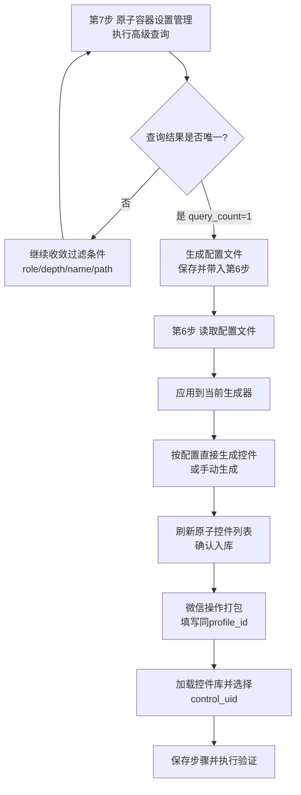
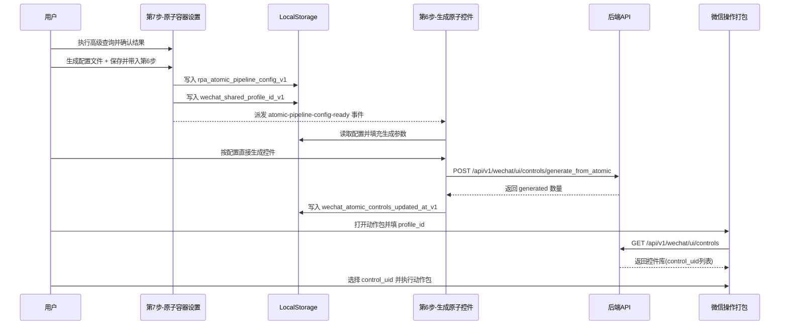

# 控件生成与微信操作使用说明（学习版）

本文用于帮助你快速掌握这条链路：

**原子容器设置管理（第7步） → 生成原子控件（第6步） → 微信操作打包**。

---

## 1. 你要先记住的核心概念

1) 候选控件（来自查询/发现）  
- 在“原子容器设置管理”通过高级查询找到的节点。
- 还不是最终可编排控件。

2) 标准控件（入库控件）  
- 在“生成原子控件”里写入控件库（绑定 `profile_id` + `control_uid`）。
- 这是“微信操作打包”可选择的控件。

3) 动作包（流程编排）  
- 在“微信操作打包”里组合动作步骤，引用标准控件执行。

---

## 2. 总流程图（推荐你先看）

---

## 3. 页面操作流程（一步一步照做）

### 第一步：在第7步筛选唯一控件

入口：`RPATest` → `7.原子容器设置管理`

- 先使用“预设规则”（可选）。
- 在“全面查询定义”里填写过滤项（`role_contains`、`name_contains`、深度、路径等）。
- 点击“执行高级查询”。
- 目标是让查询结果变成唯一（1条）。

> 建议：核心控件（发送按钮/输入框/第一联系人）尽量做到唯一后再生成。

### 第二步：生成配置文件并带入第6步

在第7步的“链路落地：生成配置文件并带入生成原子控件”区块：

- 输入“目标 `profile_id`”（后续第6步和操作打包都要用同一个）。
- 点击“生成配置文件”。
- 点击“保存并带入第6步”。

此时系统会保存本地配置，并通知第6步读取。

### 第三步：在第6步完成控件入库

入口：`RPATest` → `6.生成原子控件`

在“来自第7步的配置文件”区块：

- 先点“读取配置文件”（可选，通常自动已读取）。
- 点“应用到当前生成器”（只预填参数，不执行）。
- 若配置为唯一控件（`query_count = 1`），可点“按配置直接生成控件”。

> 保护规则：当 `query_count != 1`，直接生成按钮会被禁用，避免误生成噪声控件。

### 第四步：在微信操作打包里引用控件

入口：`微信操作打包`

- 选择或新建动作包。
- 填写同一个 `profile_id`。
- 点击“加载控件库”。
- 在步骤中选择 `control_uid`。
- 保存步骤，先 `Dry Run`，再真实执行。

---

## 4. 执行逻辑图（系统在背后做了什么）

---

## 5. 字段与命名建议（减少后期维护成本）

- `profile_id`：同一套界面模板统一使用同一个。
- `control_uid`：尽量语义化且稳定，如：
  - `chat.first_contact`
  - `chat.input`
  - `chat.send_button`
- `region_key`：建议固定口径，如：
  - `contact_list`
  - `chat_display`
  - `chat_input`
  - `main_menu`

---

## 6. 常见问题与排查

### Q1：第6步看不到“按配置直接生成控件”可用？

- 检查第7步配置里的 `query_count` 是否为 1。
- 不为 1 时系统会禁用按钮，这是预期行为。

### Q2：操作打包加载不到控件？

- 检查动作包 `profile_id` 是否和第6步生成时一致。
- 回到第6步刷新“已生成原子控件列表”确认确实已入库。

### Q3：生成了很多无关控件？

- 说明查询过滤太宽。
- 回第7步收紧条件（role/name/path/depth/limit）。

---

## 7. 建议训练路径（给学习者）

1. 先用“第一联系人 + 输入框 + 发送按钮”做一个最小闭环。  
2. 成功后再扩展聊天容器/弹窗菜单。  
3. 每加一类控件，固定 `control_uid` 命名规范并记录到团队文档。

---

## 8. 最小闭环清单（Checklist）

- [ ] 第7步高级查询结果为唯一（`query_count=1`）
- [ ] 已生成并保存配置文件
- [ ] 第6步已按配置生成并确认入库
- [ ] 微信操作打包已加载同一 `profile_id` 控件库
- [ ] Dry Run 通过
- [ ] 真实执行通过
